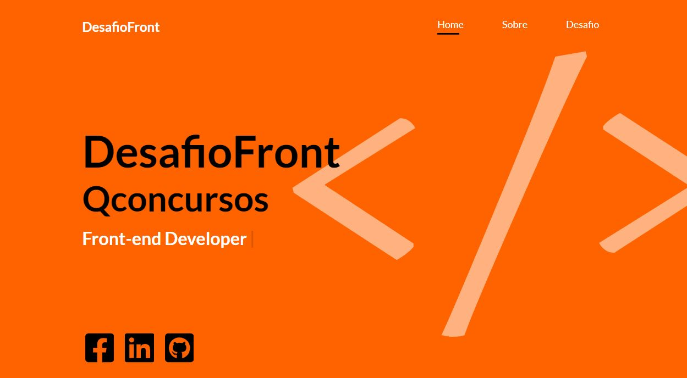

# Desafio Front-end QConcursos

[](https://github.com/ViniciusMDuarte)
[](https://www.linkedin.com/in/viniciusmduarte/)


## Sobre o desafio

**O Desafio Fron-end da QConcursos** consiste na criação de uma Landing Page utilizando HTML CSS e JS puro, o layout foi fornecido pela equipe técnica da empresa, resolvi que deveria estudar um pouco da marca da empresa e a daí partir para conceitos de cores, tipografias, espaçamentos, entre outros, estudei também o público alvo QC que são os alunos, sendo assim alterando o design do layout enviado e trazendo um tela mais cativante para os alunos e usuários.

## Sobre o projeto

**O Projeto** se resume em uma feature de consumo da API do **GITHUB** , que permite você buscar repositórios e perfis de usuários dentro do GITHUB no campo de busca da LP.

<a href="https://determined-swirles-972f11.netlify.app" target="_blank">Deploy</a>

## Ferramentas

O projeto foi desenvolvido utilizando as seguintes tecnologias:

- **HTML5**
- **CSS3**
- **SASS**
- **Design Responsivo**
- **JavaScript Puro**
- **Consumo API**


## Screenshot

<h1 align="center">
   
</h1>

## Video

<h1 align="center">
   
</h1>


## Para iniciar

```bash

    # clone repository
    $ git clone https://github.com/ViniciusMDuarte/desafio-frontend.git

    # Enter directory
    $ cd desafio-front end

    # abra a pasta public e abra index.html
    $ cd rode o projeto
    
```
