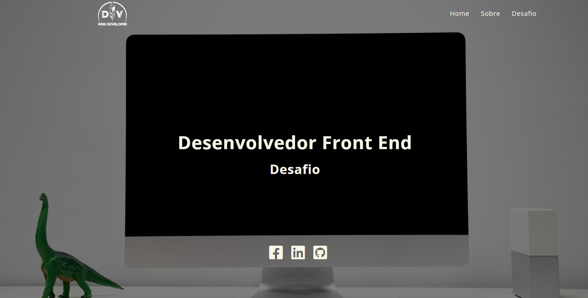

# Desafio Desenvolvedor Front-end Chalenge - Qconcursos

Este repositório foi criado com o objetivo de resolver o desafio Front-End da empresa QConcursos. 

O desafio consiste em implementar uma landing page onde o projeto tem o foco consumir a API do GitHub e devolver algumas informações do usuário, como: nome,imagem,repositórios, favoritos, seguidores e seguidos.

O desafio foi solucionado utilizando HTML,CSS e JavaScript Vanilla. Na parte de CSS, também foi utilizado o media querie para o design responsívo para diversost tipos de dispositivo. 

confira o link do site hospedado [clicando aqui](https://danvilela-desafioqconcursos.netlify.app/)

### Home do Desafio:

